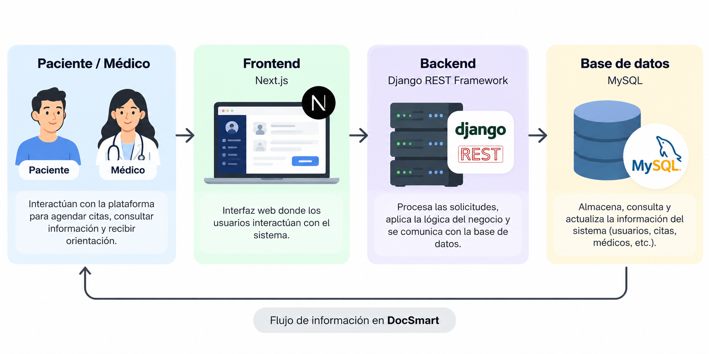
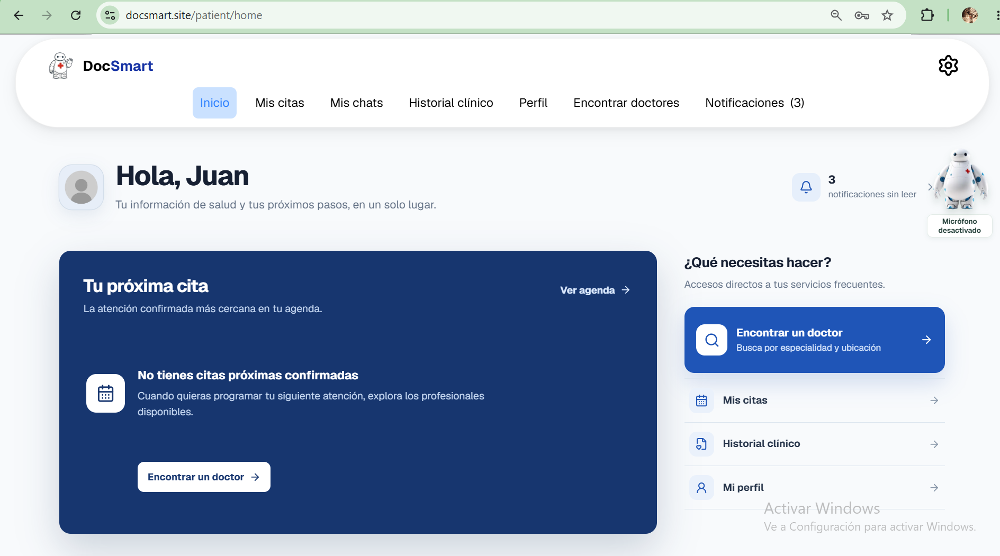
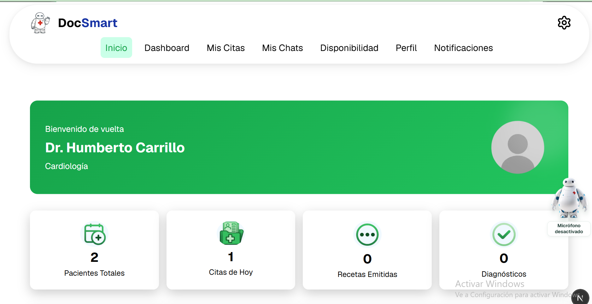

<!--
  PLANTILLA DE REFERENCIA
  Este es un ejemplo de README profesional. Puedes usarlo como base o seguir otro formato.
  Cómo usarlo: copia este archivo en la raíz de tu repo con el nombre README.md
  y reemplaza todo lo que está entre [corchetes] con la información de tu proyecto.
  Borra las secciones que no apliquen. (Este comentario no se ve en GitHub.)
-->

# Doc Smart

> Sistema web para que pacientes gestionen sus citas médicas y reciban orientación, mientras los médicos administran su atención.


## 📌 El problema
Los pacientes suelen tener dificultades para encontrar médicos, gestionar sus citas y acceder de forma organizada a servicios de salud. DocSmart busca centralizar estos procesos en una plataforma web, facilitando la conexión entre pacientes y médicos.

## ✅ La solución
DocSmart permite a los pacientes **buscar médicos según sus necesidades, agendar y gestionar citas médicas desde un solo lugar**. Además, facilita la comunicación y el seguimiento de la atención entre pacientes y médicos.


**Funcionalidades principales:**
- Búsqueda de médicos por especialidad o ubicación.
- Agendamiento y gestión de citas médicas.
- Chatbot inteligente para brindar orientación y apoyo tanto a pacientes como a médicos.

## 🛠️ Tecnologías
| Capa | Tecnología |
|---|---|
| Frontend | React, Html, Css, Js |
| Backend | Django, Python |
| Base de datos | MySQL|
| Otras | Git, GitHub |

## 🏗️ Arquitectura



## 🚀 Cómo ejecutarlo
**Requisitos:** [Ej: XAMPP 8, Python 3.12, Node 20]

```bash

# 1. Clonar el repositorio
git clone [URL_DEL_REPOSITORIO]
cd DocSmart

# 2. Instalar dependencias del backend
cd backend
python -m venv venv
venv\Scripts\activate
pip install -r requirements.txt

# 3. Configurar las variables de entorno
# Crear el archivo .env con las variables necesarias

# 4. Aplicar las migraciones
python manage.py migrate

# 5. Ejecutar el backend
daphne -b 0.0.0.0 -p 8000 core.asgi:application

# 6. En otra terminal, instalar dependencias del frontend
cd frontend
npm install

# 7. Ejecutar el frontend
npm run dev
```

**Demo:** https://docsmart.site/

## 📸 Capturas
| Pantalla | Descripción |
|---|---|
|  | Pagina principal del paciente |
|  | Pagina principal del médico |

## 👥 Equipo
| Nombre | Rol | GitHub |
|---|---|---|
| Juan Pablo Alvarez | Full Stack | @PabloAlvarez1212 |
| Kleider Echeverry | Full Stack | @kleyder15 |
| Miguel Racero | Full Stack | @Angel-12334 |

## 📄 Contexto
Proyecto formativo del programa **Análisis y Desarrollo de Software (ADSO)** · SENA · Centro tecnológico del mobiliario · 2026.
